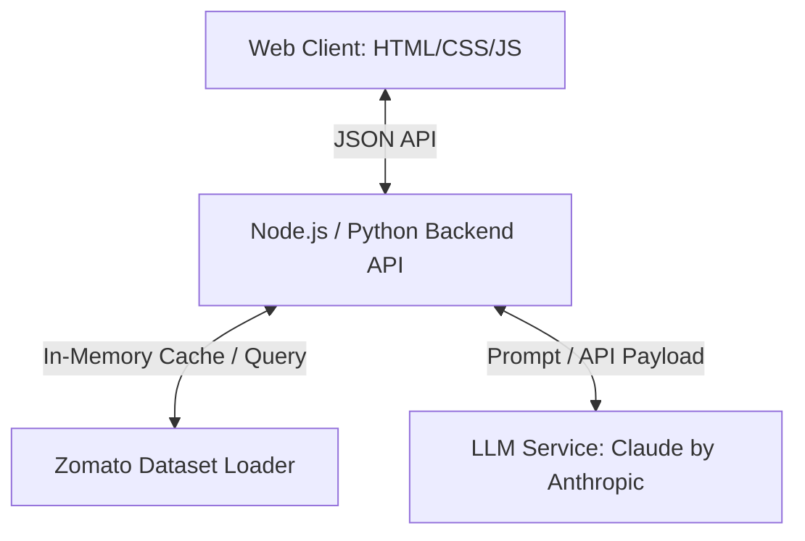
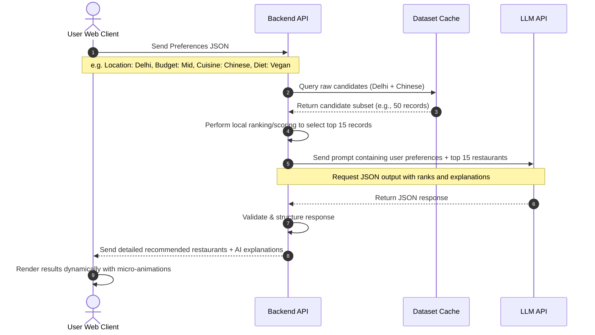

# System Architecture: Zomato AI Recommendation System

This document outlines the detailed system architecture, component design, data flow, and API structure for the Zomato AI Restaurant Recommendation System.

---

## 1. Architectural Goals & Design Philosophy
The architecture is designed to be **lightweight, responsive, and robust**, combining fast client-side inputs with a cost-effective, prompt-optimized LLM backend.

- **Minimizing LLM Latency & Cost:** To prevent sending thousands of restaurants to the LLM, the system employs a **two-tier recommendation pattern**:
  1. **Tier 1 (Hard Filtering):** Direct, local database query or in-memory filtering (e.g., location, minimum rating, budget limits) to narrow the list to the top $N$ candidates (e.g., 10-15 restaurants).
  2. **Tier 2 (AI Re-Ranking & Explanation):** Passing only these $N$ candidates to the LLM to perform contextual ranking, qualitative alignment with soft preferences (e.g., "diet-friendly", "ideal for quick lunches"), and explanation generation.
- **Single-Page Application (SPA) Experience:** Premium aesthetics, micro-interactions, responsive grid layout, and real-time state visualization (e.g., skeleton loaders, transition animations).

---

## 2. System Components



### 2.1. Client Frontend (Presentation Layer)
- **Tech Stack:** Semantic HTML5, Vanilla CSS3 (custom CSS variables, dark/light theme, modern typography), Vanilla JavaScript (ES6+).
- **Core Interfaces:**
  - **Preferences Form:** Captures location, budget, cuisine, rating minimum, delivery speed, promotions, and dietary/general preferences.
  - **Results Panel:** Displays AI-generated explanations alongside restaurant details in card grids.
  - **Interactive Explainers:** Hover actions and micro-animations to highlight why specific restaurants match individual filters.

### 2.2. Backend API Layer (Orchestration Layer)
- **Routing & Controllers:** Exposes API endpoints for ingestion, preference submission, and recommendations.
- **Ingestion Service:** Responsible for fetching, parsing, and caching the Zomato dataset from Hugging Face locally to prevent remote bottlenecking.
- **Filtering Engine:** Executes local matching rules on the cached dataset to crop candidates before prompting.
- **LLM Client:** Packages prompts, manages API keys, sets timeouts, and parses structured LLM outputs.

### 2.3. Data Store (Dataset Representation)
- **Source:** [ManikaSaini/zomato-restaurant-recommendation](https://huggingface.co/datasets/ManikaSaini/zomato-restaurant-recommendation)
- **Local Representation:** Cached as a JSON, SQLite, or CSV file for lightning-fast reads.
- **Data Model Schema:**
  | Field | Type | Description |
  | :--- | :--- | :--- |
  | `id` | String / Int | Unique restaurant identifier |
  | `name` | String | Restaurant name |
  | `location` | String | Neighborhood or area name |
  | `cuisines` | Array (String) | Cuisines offered (e.g., `["Chinese", "North Indian"]`) |
  | `rating` | Float | Average rating out of 5.0 |
  | `approx_cost` | Int | Cost for two people (numerical value) |
  | `delivery_time` | Int | Average delivery time in minutes |
  | `offers` | Array (String) | Active promotions (e.g., `["BOGO", "20% Off"]`) |
  | `characteristics` | Array (String) | Features (e.g., `["Vegetarian-Friendly", "Outdoor Seating"]`) |

### 2.4. LLM Recommendation Agent (Prompt Engine)
- **Input:** Prefiltered candidate restaurant array + User preferences list + system guidelines.
- **Output:** Structured JSON schema describing ranked list with customized explainability.

---

## 3. Sequential Data Flow



---

## 4. Prompt Engineering & LLM Schema

To guarantee consistent outputs and avoid LLM hallucinations, the backend communicates using structured JSON schemas.

### 4.1. Prompt Construction
The prompt is constructed dynamically:
1. **System Prompt:** Sets the persona ("Expert Local Food Guide"), instructs on JSON formatting, and enforces rules (e.g., "Do not recommend restaurants outside the provided list").
2. **Context (Candidate Restaurants):** Serialized JSON string of top 15 pre-filtered restaurants.
3. **User Query:** Captures explicit user constraints and soft preferences.
4. **Output Format Enforcer:** Enforces JSON responses matching the schema exactly.

### 4.2. Target JSON Schema Response
```json
{
  "recommendations": [
    {
      "restaurant_id": "string",
      "name": "string",
      "rank": 1,
      "match_percentage": 95,
      "ai_explanation": "string explaining why this fits the user's dietary preferences, location, and budget constraints.",
      "highlighted_tags": ["string", "string"]
    }
  ]
}
```

---

## 5. Security & Performance Considerations

- **LLM Cost Control:** Direct limits on candidate size (maximum 15 restaurants) to ensure token counts stay within a predictable and low cost range.
- **CORS & Rate Limiting:** Backend rate-limiting prevents API abuse or runaway LLM costs.
- **Graceful Degradation:** If the LLM call fails (timeout or rate limit), the backend falls back to returning the locally filtered results directly with standard descriptions instead of crashing.
- **In-Memory Caching:** Dataset is parsed once at startup and stored in-memory or in a local lightweight cache (SQLite/JSON) for rapid retrieval.
