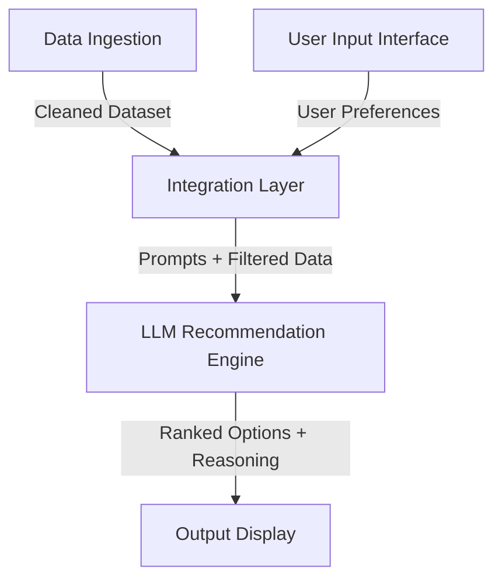

# Zomato AI Restaurant Recommendation System

## 1. Project Overview & Vision
The **Zomato AI Restaurant Recommendation System** is an AI-powered assistant designed to eliminate decision fatigue for users browsing food delivery options. By leveraging real-world restaurant data and large language models (LLMs), the system turns detailed, multi-dimensional user preferences into a curated, personalized, and explainable list of dining recommendations.

---

## 2. Problem Statement & Motivation
Modern food delivery platforms offer thousands of choices, leading to choice overload and decision paralysis. While traditional filters (e.g., sort by rating, price range) exist, they are often too rigid and still leave users with hundreds of options to filter manually. Users rarely have the chance to express complex, natural-language preferences (e.g., "healthy low-budget North Indian food near me with quick delivery").

**The Solution:** An LLM-driven recommendation interface that:
1. Takes rich user input.
2. Filters down a high-quality Zomato dataset.
3. Uses LLM reasoning to rank the options and provide friendly, human-like explanations for why each restaurant was chosen.

---

## 3. Core Objectives
- **Detailed Preference Capturing:** Accept structured inputs and soft preferences (location, budget, cuisine, rating thresholds, delivery time, discounts/promotions, diet preferences).
- **Real-World Data Grounding:** Use a real-world Zomato dataset to ground recommendations in actual restaurant names, cuisines, locations, costs, and reviews.
- **LLM Reasoning & Explanation:** Leverage an LLM to evaluate, rank, and explain recommendation choices.
- **Polished Presentation:** Deliver a clean, modern, and user-friendly interface highlighting restaurant details alongside AI-generated justifications.

---

## 4. System Architecture & Workflow

The recommendation system consists of five distinct stages:

### 4.1. Data Ingestion
- **Dataset Source:** Zomato Restaurant Recommendation dataset from Hugging Face ([ManikaSaini/zomato-restaurant-recommendation](https://huggingface.co/datasets/ManikaSaini/zomato-restaurant-recommendation)).
- **Attributes Extracted:** Restaurant Name, Location, Cuisine, Cost for Two, Average Rating, Delivery Time, Discount/Promotion availability, and special characteristics.

### 4.2. User Input & Preferences
The frontend or CLI interface collects:
- **Location:** (e.g., Delhi, Bangalore)
- **Budget:** (Low, Medium, High)
- **Cuisine:** (e.g., Chinese, North Indian, Italian)
- **Minimum Rating:** (e.g., 4.0+)
- **Delivery Time:** (e.g., under 30 minutes)
- **Discounts/Promotions:** (e.g., Buy One Get One Free, 25% off)
- **Additional Preferences:** (e.g., Vegan, Gluten-Free, Pet-Friendly, Outdoor Seating)

### 4.3. Integration Layer
- **Filtering:** Filters the dataset based on hard constraints (e.g., matching location and rating minimums) to reduce the token payload.
- **Prompt Engineering:** Formulates a structured prompt that passes the user's constraints alongside the candidate restaurants to the LLM.

### 4.4. Recommendation Engine
- **Processing:** Passes candidate data to the LLM.
- **Role of the LLM:**
  - Rank candidate restaurants based on soft matching.
  - Compose a unique, human-like explanation highlighting why each recommended restaurant fits the user's criteria.

### 4.5. Output Display
Renders a curated interface displaying:
1. **Restaurant Name** & branding.
2. **Cuisine** & specialties.
3. **Rating** & pricing overview (Estimated cost for two).
4. **AI-Generated Explanation** explaining the reasoning behind the recommendation.

---

## 5. Reference Links & Resources
- **Data Source:** [Hugging Face Dataset](https://huggingface.co/datasets/ManikaSaini/zomato-restaurant-recommendation)
- **Source Problem Statement:** [problemStatement.txt](file:///c:/Users/Varun%20Jain/OneDrive/Desktop/Product%20Management/Vibe%20coding%20projects/Zomato%20AI/docs/problemStatement.txt)
